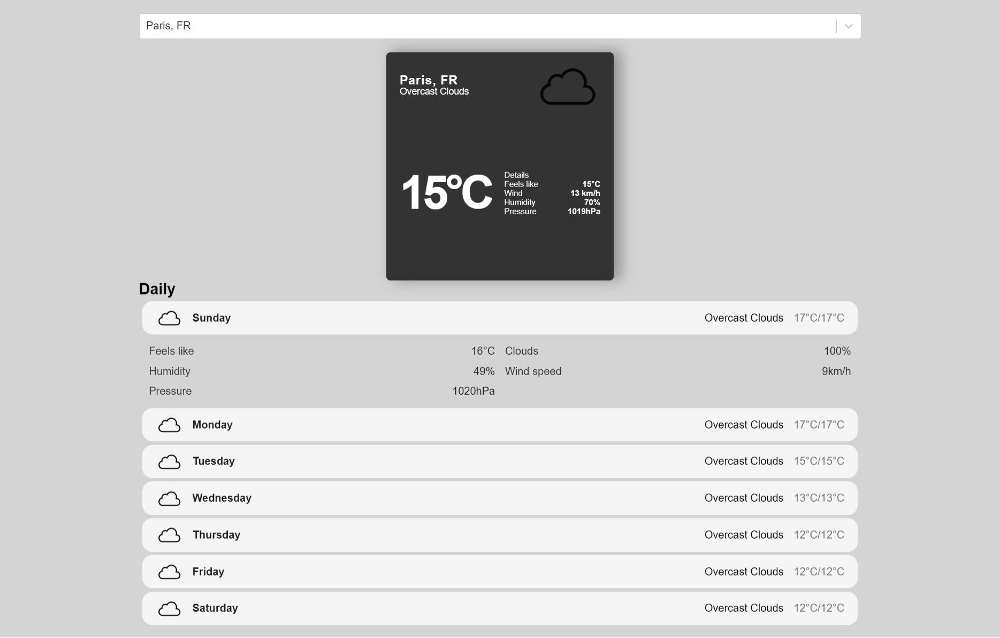
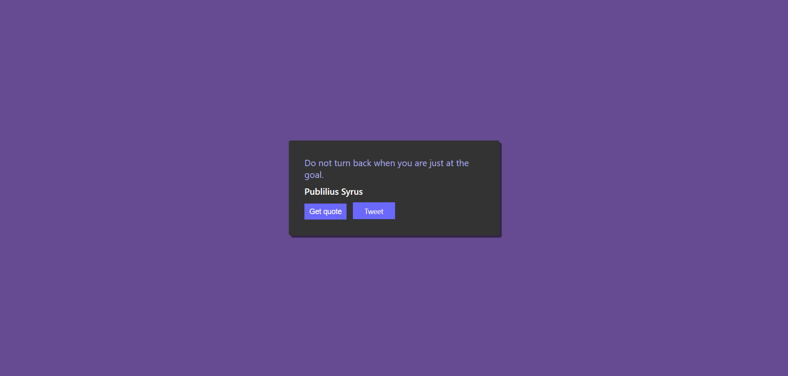
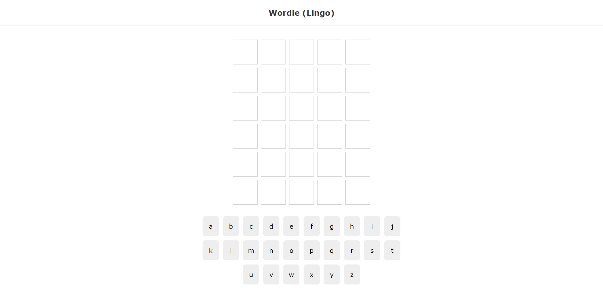
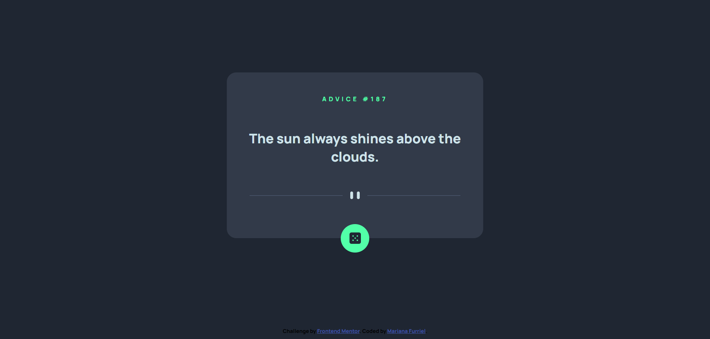
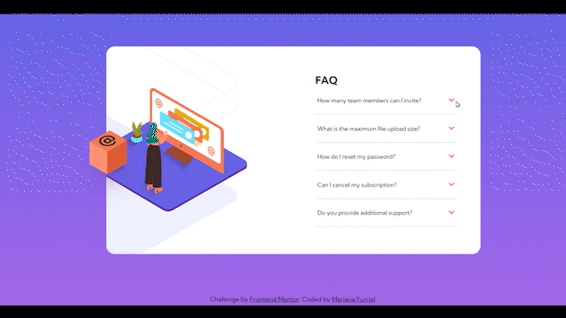
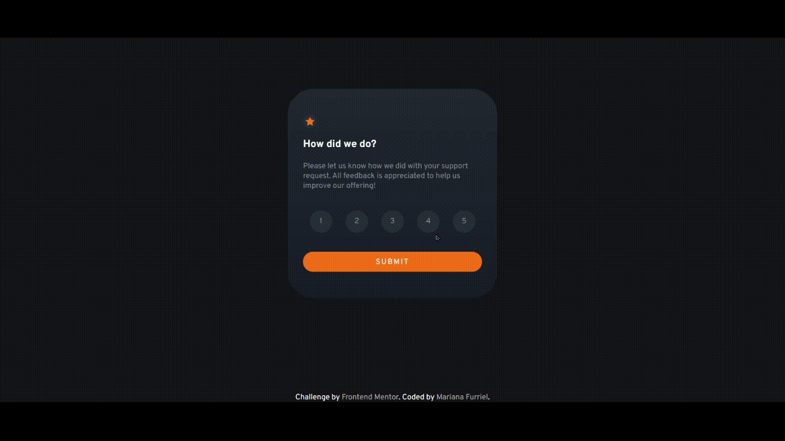
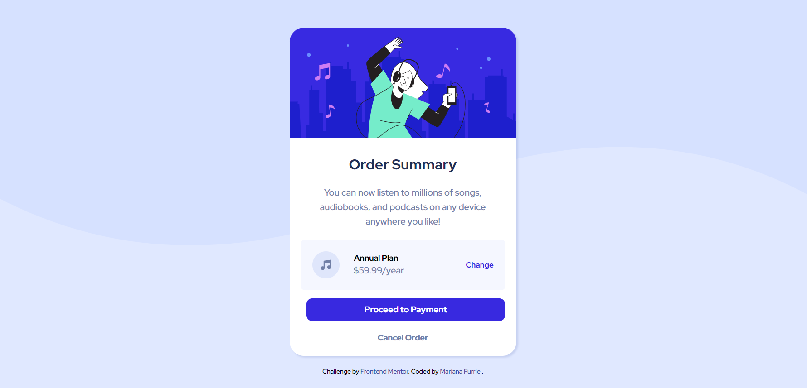

# Frontend Learning

* [Frontend Mentor](#Frontend-Mentor)
* [Previsão do tempo com React](#Previsão-do-tempo-com-React)
* [Gerador de citações](#Gerador-de-citações)
* [Gerador de citações de Breaking Bad](#Gerador-de-citações-de-Breaking-Bad)
* [Clone do Wordle com React](#Clone-do-Wordle-com-React)
* [Conversor de Algoritmos de Cubo Mágico](#Conversor-de-Algoritmos-de-Cubo-Mágico)
### Previsão do tempo com React
Um site simples que diz o tempo atual e mostra a previsão para os próximos sete dias, em qualquer cidade (que tenha pelo menos 1.000.000 de habitantes) que pesquisarmos. A barra de pesquisa tem sugestão de cidade com base do texto já digitado. Utilizei dados recebidos das APIs [GeoDB Cities](https://rapidapi.com/wirefreethought/api/geodb-cities/) e [Open Weather](https://openweathermap.org/). Fiz junto com [esse](https://www.youtube.com/watch?v=Reny0cTTv24&t=1106s) tutorial. Foi meu primeiro projeto em React, aprendi bastante sobre como utilizar essa ferramenta e também como receber dados de APIs, tratar e organizar esses dados para exibir para o usuário, além de ser o primeiro projeto que hospedei de fato, então precisei aprender algumas configurações específicas sobre o assunto.
Você pode ver o projeto funcionando [aqui](https://weathermf.netlify.app/)

  
Ver captura de tela

  

### Gerador de citações
Um gerador de frases feito com React, que pega dados de uma API e mostra na tela. Feito junto com [esse](https://www.youtube.com/watch?v=OpXpwY9Gbzg) tutorial, consome dados [dessa](https://type.fit/api/quotes) API. Projeto rodando [aqui](https://randomquotesmf.netlify.app/).

  
Ver captura de tela

  

### Gerador de citações de Breaking Bad
Um gerador de citações da sério Breaking Bad feito com React, que pega dados de uma API e mostra na tela. Baseado no projeto anterios. Consome dados [dessa](https://breakingbadquotes.xyz/) API. Projeto rodando [aqui](https://breakingbadquotesmf.netlify.app/).
<!-- 

  
Ver captura de tela

  

 -->

### Clone do Wordle com React
Um clone do jogo [Wordle](https://www.nytimes.com/games/wordle/index.html) feito em React junto com [esse](https://www.youtube.com/playlist?list=PL4cUxeGkcC9gXdVXVJBmHpSI7zCEcjLUX) tutorial. Adaptei para pegar dados [dessa](https://rapidapi.com/sheharyar566/api/random-words5/?utm_source=ANIA-KUBOW&utm_medium=DevRel&utm_campaign=DevRel) API. Você pode jogar [aqui](https://wordlemf.netlify.app/).

  
Ver captura de tela

  

### Conversor de Algoritmos de Cubo Mágico
Um projeto para facilitar a vida dos cubistas. Temos as opções de converter rotação x, y e z, além de inverter o algoritmo para cairmos em um caso especifico. A ideia surgiu enquanto eu estava aprendendo o método avançado e tive algumas dificuldades com rotações e queria remover elas mas deixando os algoritmos equivalentes, o problema seria fazer isso para todos os algoritmos, então criei esse projeto para me ajudar e disponibilizo para quem quiser usar e aprimorar. Os estilos ainda estão em desenvolvimento, mas o projeto já está 100% funcional. Veja ele funcionando [aqui](https://conversoralgcubo.netlify.app/)

## Frontend Mentor
Os desafios iniciam com as imagens, as cores e alguns parâmetros básicos, além das imagens dos designs. Todo o resto fica por nossa conta. Abaixo estão as minhas versões dos desafios.

* [Advice Generator App](#Advice-Generator-App)
* [FAQ Accordion Card Main](#FAQ-Accordion-Card-Main)
* [Interactive Rating Component Main](#Interactive-Rating-Component-Main)
* [Intro Component With Sign-up Form](#Intro-Component-With-Sign-up-Form)
* [Order Summary Component](#Order-Summary-Component)
* [Stats Preview Card Component](#Stats-Preview-Card-Component)

### Advice Generator App
Um site simples que busca conselhos em inglês de uma API e joga na tela. Feito com HTML, CSS, com media queries para responsividade em dispositivos com até 375 pixels de largura, além de efeitos de brilho no botão, e Javascript. Você pode ver o projeto funcionando [aqui](https://conselhosmf.netlify.app/)

    
Ver captura de tela

  

### FAQ Accordion Card Main
Um componente de perguntas comuns, usando um acordeão. Feito em HTML, CSS e Javascript vanilla.Você pode ver o projeto rodando [aqui](https://marianafurriel.github.io/frontendmentor/Faq%20Accordion%20Card%20Main)

  
Ver captura de tela

  

### Interactive Rating Component Main
Um componente de avaliação, feito com HTML, CSS e Javascript vanilla. Projeto rodando [aqui](https://marianafurriel.github.io/frontendmentor/Interactive%20Rating%20Component%20Main)

  
Ver captura de tela

  

### Intro Component With Sign-up Form
Uma página de cadastro feita com HTML, CSS e com validação de campos em Javascript vanilla. Gostei bastante de entender melhor sobre manipulação de DOM com esse projeto. Você pode ver ele funcionando [aqui](https://formulariomf.netlify.app/)

  
Ver captura de tela

  

### Order Summary Component
Um elemento de resumo de pedido, feito com HTML e CSS. Você pode ver o projeto rodando [aqui](https://marianafurriel.github.io/frontendmentor/Order%20summary%20component/).

  
Ver captura de tela

  

### Stats Preview Card Component
Um card de estatísticas simples feito em HTML, CSS e Javascript. Você pode ver acessar [aqui](https://statsmf.netlify.app/)

  
Ver captura de tela

  

